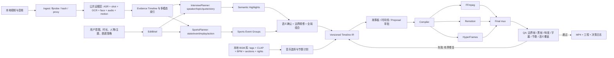

# 视频剪辑 Agent 深度调研（第二轮：长视频集锦双路径）

> 面向：长访谈 / 体育赛事 → 长视频理解 → 发现高光 → LLM 按用户意图组织集锦 → 本地检索 BGM → 可审阅工程 → 合成视频  
> 日期：2026-09-06  
> 范围：`video-agents.md` 中 33 个具备本地实现、工程协议或可复用源码的仓库，并补充 BaoCut 与 HyperFrames，共 35 个仓库。仅提供开源 Skill/知识、实际剪辑依赖托管 API/MCP 的项目不纳入本报告。

视觉伴读：[交互式长视频高光剪辑阶段图](/Users/panjx/code/video-agent/research/show-me-long-video-highlight-pipeline.html)

## 结论先行

35 个项目并不是同一种产品的不同实现，而是分散在素材理解、高光发现、编辑编排、时间线 GUI、制作流水线和代码渲染底座等层面。对“长访谈 + 体育赛事”最重要的新判断是：**后半段可共享，前半段必须分成两个领域导演脑。**

首轮五个重点仓库仍分别代表不同层面：

- **video-use**：最好的“LLM 可读素材表示”样板。核心不是 FFmpeg，而是把长视频压缩成词级转写与按需视觉时间轴，让 LLM 不必吞所有帧。
- **FireRed-OpenStoryline**：与目标产线最像的端到端节点图。它已经把镜头切分、VLM 理解、筛选、分组、写稿、选 BGM、卡点、时间线和渲染串起来。
- **OpenMontage**：最值得借鉴的不是某个渲染器，而是生产治理：显式阶段、结构化产物、素材 provenance、审批门、成本预算、质量门、失败回退。其 documentary-montage 还提供了最完整的本地素材库与语义选片范式。
- **OpenChatCut**：最成熟的“Agent 修改真实工程”样板。它解决工程状态、帧级时间线、可验证草稿、原子提交、撤销重做、人工审阅和可视化，而不是只返回一个 MP4。
- **OpenEdit**：最有价值的是字幕/MG 的设计知识、确定性 recipe、渲染前机械检查和渲染后探针；它不是通用时间线编辑器，V1 仍以字幕为主。

因此建议不要 fork 某一个项目并一路魔改。更合理的产品架构是：

1. 用 **video-use + premiere-agent** 设计低 token、可下钻的多模态 Evidence Timeline；
2. 用 **ClipTalk** 的召回—语义确认—边界精修—事件归组骨架建立通用高光层；
3. 访谈侧融合 **ChatMonteur、BaoCut、video-edit-cli** 的词级语义、说话人、停顿和质量门；
4. 赛事侧新增当前仓库普遍缺失的项目专属事件本体、比分/时钟状态机与直播—回放关联；
5. 用 **OpenStoryline/Montaj 的节点链**定义可适配业务流程；
6. 用 **OpenMontage 的 corpus + retrieval + checkpoint/gate**升级素材检索与生产治理；
7. 用 **OpenChatCut/Frontstage/Timeline Studio** 的工程命令、proposal、revision 和 undo 做可编辑工程与 GUI；
8. 用 **OpenEdit、Pireel Frames、video-shotcraft** 建设字幕/MG 的 recipe 与可插拔视觉语言；
9. FFmpeg 负责剪切、转码、混音和最终封装；Remotion/HyperFrames 只是图形合成后端，不应成为核心工程格式。

## 一、调整后的调研维度：公共内核 + 两类导演脑

“访谈集锦”和“赛事集锦”只有后半段工程链相似，前半段的高光定义并不相同。今后不再用一个笼统的“视频理解”维度评价仓库，而分为三组。

### A. 公共剪辑内核

| 维度 | 要问的问题 | 证据产物 |
|---|---|---|
| 产品任务 | 是压缩原片、抽单条短视频、完整集锦、字幕包装，还是从想法生成整片？ | 明确输入、输出和主路径 |
| 媒体规范化 | 是否处理 VFR/CFR、fps、time base、色彩、HDR、旋转、多音轨和代理文件？ | probe manifest / normalized proxy |
| LLM 阅读面 | LLM 看全帧、联系表、转写、事件流、embedding 结果还是分层摘要？ | packed timeline / shot cards |
| 候选生成 | 召回信号与最终语义判断是否分离？是否支持 top-k、去重和替补？ | candidate pool + evidence |
| 边界精修 | 是否避免截词、截动作、截反应？是否表达 safe range 与 minimum keep？ | source range + safe ranges |
| 全局编排 | 是否处理重复、时长预算、铺垫—高潮—余韵、剧透与跨事件连续性？ | event/beat graph + ordered EDL |
| 编辑中间表示 | 是否区分 source time 与 output time，并具备帧级轨道、版本、理由和 provenance？ | versioned Timeline IR |
| Agent 写入模型 | 是任意 JSON/FFmpeg，还是 inspect → propose/diff → validate → apply → undo？ | 强 schema 命令与 revision |
| 人机协作 | 用户能否在候选、事件故事板、时间线 proposal 和终片阶段纠偏？ | reviewable proposal |
| 音乐与声音 | 是否有语义检索、BPM/downbeat/section/energy、原声保留和 ducking？ | music plan + automation |
| 渲染与包装 | FFmpeg、Remotion、HyperFrames 分别承担什么，字幕/MG 是否可插拔？ | compiler jobs / overlays |
| QA 与治理 | 是否有缓存、幂等、checkpoint、静态 lint、边界审片、输出探针、成本和版权记录？ | QC report + decision log |

### B. 长访谈专属维度

| 维度 | 要问的问题 | 典型失败 |
|---|---|---|
| 词级语音证据 | ASR 是否有词级时间、标点、置信度和 no-speech 信息？ | 根据句级 SRT 截断半个词 |
| 说话人和轮次 | 是否 diarization、声纹检索、问答配对、打断与串话处理？ | 问题被删，只剩无法理解的回答 |
| 语义单元 | 是否识别观点、故事、论据、金句、冲突、结论和 topic shift？ | 只按静音切，内容仍冗长 |
| 表达完整性 | 能否保留指代上下文、前提、完整句和必要停顿？ | 金句听起来断章取义 |
| 内容价值 | 信息密度、独特性、可信度、情绪、hook 能力如何分别评分？ | 只挑情绪强的空洞片段 |
| 对话剪辑语法 | 是否有 J/L cut、reaction、B-roll、retake/filler 区分？ | 每段都是生硬 jump cut |
| 多版本策略 | 同一访谈能否按主题、人物、时长生成不同版本？ | 只有一个不可解释的“最佳片段” |

### C. 体育赛事专属维度

| 维度 | 要问的问题 | 典型失败 |
|---|---|---|
| 比赛状态 | 是否识别项目、队伍/选手、节次/回合、比赛时钟、比分和比分变化？ | 不知道一次得分是否扳平或绝杀 |
| 事件本体 | 是否有项目专属事件 taxonomy 与 detector，而不只是通用 VLM caption？ | 把普通射门和进球混为一谈 |
| 多模态召回 | 是否融合动作、转播切镜、解说、欢呼、哨声、比分 OCR 和重放标志？ | 把声音峰值直接当事件 |
| 事件完整性 | 是否组织 setup → action → reaction → replay → result？ | 只留下得分瞬间，没有来龙去脉 |
| 回放与重复 | 能否把直播动作、多个慢放和庆祝归为同一事件？ | 一个进球在集锦中出现三次 |
| 重要性与悬念 | 是否区分刺激度、比赛重要性、叙事位置和 spoiler policy？ | 开头直接泄露最终结果 |
| 动作安全边界 | 是否避免从动作中间切入、在结果出现前切走？ | 高光“看不清发生了什么” |
| 赛事包装 | 比分/球员/时间等字幕卡是否以可信状态数据驱动？ | LLM 幻觉比分或球员身份 |

看仓时最重要的原则仍然是：**把“智能高光”拆成可检验的 artifact 和状态转换。** 检测器峰值只应产生 recall candidate；只有被语义确认、边界完整、去重归组并进入可审阅事件结构后，才有资格成为可剪素材。

## 二、五个重点仓库

### 1. video-use：最小但思想最干净的剪辑 Agent

**产品定位。** 它的主任务是对已有素材做对话式剪辑：去口误和停顿、跨 take 选段、调色、字幕、可选动画 overlay，最后交付 MP4；没有时间线 GUI。README 明确描述了原始素材到 `final.mp4` 的路径以及功能边界（[README](/Users/panjx/code/video-agent/video-use/README.md:7)）。

**最值得借鉴：LLM 的“读视频”接口。** 它默认只把词级转写压成很小的 phrase-level Markdown，视觉只在歧义停顿、take 对比和切点检查时生成 filmstrip + waveform + word labels（[README](/Users/panjx/code/video-agent/video-use/README.md:71)）。这比“固定每秒抽帧全部送 VLM”更适合长素材。

**中间表示。** `edl.json` 是非常适合 MVP 的最小编辑表示：source、start/end、beat、quote、reason，再加 grade、字幕与 overlay。每个切点携带理由很重要，它让修改和 QA 有依据（[SKILL](/Users/panjx/code/video-agent/video-use/SKILL.md:268)）。

**质量闭环。** 它把字幕最后叠加、切点音频 fade、词边界和输出时间轴字幕偏移写成不可违反的生产规则（[SKILL](/Users/panjx/code/video-agent/video-use/SKILL.md:18)）；渲染后再对每个切点生成视觉/波形检查图，最多自修三轮（[SKILL](/Users/panjx/code/video-agent/video-use/SKILL.md:91)）。

**局限。**

- 理解明显偏音频优先，不适合大量无对白 B-roll 的全局语义选片。
- 没有项目级语义素材库、真正的多轨工程和 GUI。
- 转写默认依赖 ElevenLabs；需要抽象成可替换 ASR provider。
- LLM 直接承担选 take 和叙事判断，规模变大后需要检索层先缩小候选集。

**建议吸收。** 直接借鉴其 packed transcript、按需 `timeline_view`、最小 EDL、切点 padding/fade、渲染后边界 QA。MIT 许可证也使代码复用相对简单。

### 2. FireRed-OpenStoryline：最接近目标产线的参考实现

**产品定位。** 它是对话式视频制作流水线，明显偏 Vlog、种草、旅行、开箱等“多素材 → 叙事短片”。核心能力覆盖素材搜索/整理、画面理解、脚本、私有 BGM、配音、字体、自然语言精修和把剪辑逻辑保存为 Skill（[README](/Users/panjx/code/video-agent/FireRed-OpenStoryline/README_zh.md:44)）。GUI 是聊天、工具进度、媒体预览和节点地图，不是真正可手调的 NLE 时间线。

**节点链与我们的需求几乎同构。** 配置直接列出 `SplitShots → UnderstandClips → FilterClips → GroupClips → GenerateScript → SelectBGM → PlanTimeline → RenderVideo`（[config.toml](/Users/panjx/code/video-agent/FireRed-OpenStoryline/config.toml:43)），默认 workflow Skill 也按同样顺序指导 Agent（[default workflow](/Users/panjx/code/video-agent/FireRed-OpenStoryline/.storyline/skills/default_editing_workflow_skill/SKILL.md:9)）。

**素材理解。** 每个 clip 被送入 VLM，输出不超过 100 字的客观 caption 与美学分，然后再由 LLM 汇总整体故事（[understand_clips.py](/Users/panjx/code/video-agent/FireRed-OpenStoryline/src/open_storyline/nodes/core_nodes/understand_clips.py:53)）。默认每秒抽 2 帧、单 clip 最多 64 帧（[config.toml](/Users/panjx/code/video-agent/FireRed-OpenStoryline/config.toml:66)）。

**选片与写稿。** Filter 主要依据 caption、审美分和时长；但默认提示词强制保留超过 80% 的 clip（[filter prompt](/Users/panjx/code/video-agent/FireRed-OpenStoryline/prompts/tasks/filter_clips/zh/system.md:7)），这更像“去明显废片”，不是为脚本 beat 做竞争性选片。之后 Group 阶段强调场景聚合与 Hook → Core → Vibe → End，再依据每组画面和字数预算生成第一人称 Vlog 文案（[group prompt](/Users/panjx/code/video-agent/FireRed-OpenStoryline/prompts/tasks/group_clips/zh/system.md:16)、[script prompt](/Users/panjx/code/video-agent/FireRed-OpenStoryline/prompts/tasks/generate_script/zh/system.md:32)）。

**本地 BGM。** 这是五仓中最贴合“本地搜歌”的现成实现之一：先从本地 `bgm_dir/meta.json` 建向量库做语义召回，再由 LLM 选一首；随后用 librosa 计算 BPM、beat、能量和动态范围，并对强拍做局部归一化与峰值筛选（[select_bgm.py](/Users/panjx/code/video-agent/FireRed-OpenStoryline/src/open_storyline/nodes/core_nodes/select_bgm.py:31)、[select_bgm.py](/Users/panjx/code/video-agent/FireRed-OpenStoryline/src/open_storyline/nodes/core_nodes/select_bgm.py:220)）。时间线规划器可把片段时长对齐到 beat（[plan_timeline_pro.py](/Users/panjx/code/video-agent/FireRed-OpenStoryline/src/open_storyline/nodes/core_nodes/plan_timeline_pro.py:13)）。

**渲染。** Timeline schema 已区分 source window、timeline window、video/subtitle/voiceover/BGM tracks（[node_schema.py](/Users/panjx/code/video-agent/FireRed-OpenStoryline/src/open_storyline/nodes/node_schema.py:135)），但渲染器主要由 MoviePy 组装并由 FFmpeg 编码，视频轨实际按时间顺序 concat，复杂多轨与可编辑性有限（[render_video.py](/Users/panjx/code/video-agent/FireRed-OpenStoryline/src/open_storyline/nodes/core_nodes/render_video.py:700)、[render_video.py](/Users/panjx/code/video-agent/FireRed-OpenStoryline/src/open_storyline/nodes/core_nodes/render_video.py:845)）。

**建议吸收。** 节点 schema、VLM caption + aesthetic score、本地 BGM 元数据与节拍分析、脚本字数预算、可复用 workflow Skill。不要原样复制“保留 80% 素材”的过滤规则，也不要把 MoviePy renderer 当长期底座。

### 3. OpenMontage：生产治理与检索优先的素材库

**产品定位。** 它是“从想法/参考片到成片”的 Agent 生产系统，而不是单纯剪辑器。统一阶段为 `research → proposal → script → scene_plan → assets → edit → compose`，各阶段由 YAML manifest、Markdown director Skill、结构化 artifact、review 和 checkpoint 驱动（[README](/Users/panjx/code/video-agent/OpenMontage/README.md:362)、[architecture](/Users/panjx/code/video-agent/OpenMontage/docs/ARCHITECTURE.md:9)）。

**最值得借鉴：脚本 beat → 素材 slot → 候选 corpus → edit decisions。** documentary-montage 先要求每个 slot 有具体描述、搜索词、hold 时长和 hero 标记，再构建候选库、选一个 clip、记录 rejected picks，最后决定 in/out、转场和音乐（[pipeline manifest](/Users/panjx/code/video-agent/OpenMontage/pipeline_defs/documentary-montage.yaml:45)）。这是比“一次让 LLM 看完所有 caption 后输出顺序”更可扩展的模式。

**素材库与检索。** Corpus 将下载素材、5 帧缩略图、视觉 embedding、标签 embedding、motion score、时长、来源、原始 URL 和许可证落在项目目录（[corpus.py](/Users/panjx/code/video-agent/OpenMontage/lib/corpus.py:1)）。查询时融合 70% 视觉相似度与 30% 标签相似度，并支持 motion filter 和已使用素材排除（[corpus.py](/Users/panjx/code/video-agent/OpenMontage/lib/corpus.py:234)）；相似集合和去重采用 MMR，避免连续镜头视觉重复（[corpus.py](/Users/panjx/code/video-agent/OpenMontage/lib/corpus.py:317)）。

**检索治理。** Asset Director 明确要求 corpus 大小约为 slot 数的 8–12 倍、低分时扩库而不是硬选、top 3–5 要做人工/Agent 判断、并记录 provenance 和 rejected reason（[asset director](/Users/panjx/code/video-agent/OpenMontage/skills/pipelines/documentary-montage/asset-director.md:238)）。Edit Director 则把节奏、并置、音乐同步、统一视觉 register 和相邻镜头多样性写成可审计规则（[edit director](/Users/panjx/code/video-agent/OpenMontage/skills/pipelines/documentary-montage/edit-director.md:23)）。

**局限。**

- Corpus 当前把一个 clip 的多帧池化成单向量，容易丢失 clip 内部动作和时间结构；适合先召回，不适合直接确定精确 in/out。
- CLIP ViT-B/32 与经验阈值只是 baseline；跨语言、细动作、品牌/人物、镜头连续性仍需 VLM rerank。
- Agent 本身充当 orchestrator，灵活但难做严格状态机、并发、幂等和在线服务 SLA。
- README 与架构文档的工具数量口径不同，说明仓库迭代很快；应信 schema 和实现，不信营销数字。
- AGPL-3.0 会影响直接集成方式。

**建议吸收。** Artifact contract、slot-based retrieval、corpus provenance、双通道向量检索、MMR、多阶段审批、checkpoint、成本/质量门。建议重写为自己的服务，而不是直接把整个仓库嵌入产品。

### 4. OpenChatCut：把 Agent 输出变成“可继续编辑的工程”

**产品定位。** 它把对话 Agent 与多轨时间线放在同一工作区；所有编辑最终落到轨道、片段、字幕、转场和特效，支持审阅、撤销、重做、版本与导出，而不是只生成不可修改的 MP4（[README](/Users/panjx/code/video-agent/OpenChatCut/README_ZH.md:62)）。

**最值得借鉴：工程模型和命令边界。** `ProjectDoc` 明确包含共享素材池、多时间线、活动时间线与 design style，并有显式版本用于迁移（[projectTypes.ts](/Users/panjx/code/video-agent/OpenChatCut/src/editor/projectTypes.ts:6)）。Agent 的 `edit_item` 支持 adds/updates/deletes，在私有 draft 中整批校验，只有全部成功才发布；还支持 validate-only（[edit-item schema](/Users/panjx/code/video-agent/OpenChatCut/src/agent/tools/schemas/edit-item-tools.ts:3)）。

**人机协作模型。** 外部 Agent 先 `begin_edit_session`，所有改动进入隔离草稿，然后 `review_edit_session`；manual 模式由 GUI 逐项审阅，auto 模式原子应用，整个操作成为一个 undo 节点（[README](/Users/panjx/code/video-agent/OpenChatCut/README_ZH.md:328)）。这是目标产品最应该复用的交互语义。

**素材与音乐理解。** 它有本地 Chinese-CLIP 帧 embedding，长视频按场景抽样，fallback 默认 15 秒一帧、最多 12 帧，场景模式最多 96 帧（[types.ts](/Users/panjx/code/video-agent/OpenChatCut/src/media/semantic-search/types.ts:1)、[samplingConfig.ts](/Users/panjx/code/video-agent/OpenChatCut/src/media/semantic-search/samplingConfig.ts:28)）。音乐侧使用本地 Beat This + CLAP，输出 BPM、拍号、标签、段落和 beat/downbeat，并以只读 plan → stale ref 校验 → 单次 undo 提交的方式卡点（[music tool schema](/Users/panjx/code/video-agent/OpenChatCut/src/agent/tools/schemas/music-intelligence-tools.ts:84)）。

**指导质量。** 其 Long Video to Shorts 不只给流程，还提供可复现的候选评分：独立完整度、hook、payoff、语境完整、视觉强度、平台适配、边界和差异性，并要求保存证据说明（[selection rubric](/Users/panjx/code/video-agent/OpenChatCut/src/agent/skills/long-video-to-shorts/references/short-form-selection.md:35)）。

更直接相关的是 `livestream-to-clips` Skill：它已经把 Interview/Podcast 与 Esports/Sports 分为不同 profile。访谈要求 `question → answer → evidence/example → conclusion`，体育要求 `buildup → decisive play → result → replay/reaction`，并明确拒绝错比分/人物、没有铺垫的结果和把回放误判成直播（[profile matrix](/Users/panjx/code/video-agent/OpenChatCut/src/agent/skills/livestream-to-clips/references/profile-matrix.md:1)）。其多模态方法采用 overview → candidate → verification 三遍扫描，规定音频峰值只作为候选信号，并给出 event recall、top-k precision、boundary error、meaning fidelity 等 benchmark 指标（[multimodal selection](/Users/panjx/code/video-agent/OpenChatCut/src/agent/skills/livestream-to-clips/references/multimodal-selection.md:1)、[QA](/Users/panjx/code/video-agent/OpenChatCut/src/agent/skills/livestream-to-clips/references/qa-and-evaluation.md:50)）。这是本轮对“双方向维度”最完整的现成指导，但主要属于 Agent 知识与评测规范，不代表仓库已经实现比分状态机或项目专属事件 detector。

**局限。**

- 工程和工具面很大，若只需自动成片，直接采用会带来较高复杂度。
- 当前语义索引可用于粗召回，但默认抽样仍不足以支撑精确动作时刻选择。
- 其 AGPL-3.0 许可证需要在产品集成前单独评估。

**建议吸收。** 把它当“编辑操作系统”而不是“创作大脑”：ProjectDoc、帧级时间基准、统一 command layer、draft/proposal、undo、MCP、时间线 GUI、frame inspection、音乐 plan/apply 两阶段协议。

### 5. OpenEdit：字幕和 MG 的工业化知识库

**产品定位。** 它明确没有 GUI 和时间线，由 coding agent 驱动，支持剪切、reframe、字幕、图形、网页/幻灯片转视频等；V1 主要目标仍是 captions（[README](/Users/panjx/code/video-agent/open-edit/README.md:23)、[README](/Users/panjx/code/video-agent/open-edit/README.md:176)）。

**最值得借鉴：把创意工作拆成确定性生成和受控创作。** 默认字幕由 compiled recipe 确定性生成；只有用户提供品牌/参考或要求 remix 时才让 Agent inline author。所有路径走 lint → verify → record → probe-QA → mux（[FLOW](/Users/panjx/code/video-agent/open-edit/docs/FLOW.md:21)）。

**理解与设计分离。** Vision pass 默认关闭，只有用户要求 refine 时才读帧并输出每个 beat 的 subject/face/negative-space/brightness；后续设计只读结构化数字，不重复看图（[FLOW](/Users/panjx/code/video-agent/open-edit/docs/FLOW.md:25)）。这是降低多轮漂移的好办法。

**引擎边界被写成可测试知识。** 例如字幕必须使用真实词时序、整条视频用单一可寻址 timeline、FFmpeg 先完成暂停/变速/trim，HTML 引擎只负责视觉层（[director brief](/Users/panjx/code/video-agent/open-edit/pipeline/director-brief.md:140)、[director brief](/Users/panjx/code/video-agent/open-edit/pipeline/director-brief.md:183)）。

**局限。**

- 不提供通用可编辑工程；preview 主要是只读观看、转写跟随与 scrub。
- 自带 VEED renderer 闭源且另有 PolyForm Shield 条款；虽然可换 Chrome 后端，但不能把它视为完全开放的渲染栈（[README](/Users/panjx/code/video-agent/open-edit/README.md:127)、[README](/Users/panjx/code/video-agent/open-edit/README.md:183)）。
- MG、图表等能力在 README 中明确比 captions 少验证。

**建议吸收。** Recipe compiler、design system artifact、caption timing contract、safe-zone/face avoidance、静态 lint、渲染探针、确定性路径与创意路径分流。不要把 `.wv` 或闭源 renderer 变成产品的唯一标准。

## 三、本轮新增的关键发现

### 1. ClipTalk：目前最接近“通用长视频高光导演”

ClipTalk 是剩余仓库里与目标最贴近的项目，同时明确展示体育高光、新闻、直播反应、教程和产品视频，并提供高光、按人脸、按主题、按声纹四种检索入口（[README](/Users/panjx/code/video-agent/ClipTalk/README.md:31)）。

它的差异化不只是“VLM 看视频”：

- 先用均匀采样、场景变化、音频能量、SenseVoice 对白/情绪/声音事件等做高召回；声音峰值和画面变化候选被标记为 `recall_only`，不能直接进入成片（[pipeline.py](/Users/panjx/code/video-agent/ClipTalk/app/pipeline.py:552)）。
- 再由 VLM 在候选局部窗口精修 `start/end`、`peak range`、`minimum_keep_seconds` 和 `boundary_confidence`（[prompts.py](/Users/panjx/code/video-agent/ClipTalk/app/prompts.py:105)）。
- “事件导演”把候选镜头组织成有叙事职责、前置依赖、后继关系、情绪方向的事件组；实现明确写着 detector peak 不是事件（[event_groups.py](/Users/panjx/code/video-agent/ClipTalk/app/event_groups.py:347)）。
- 在时长预算下按完整语句或动作单元组合，不允许为了恰好满足秒数切碎语义；最后还提供 composition 级视觉审片与返修指令（[event_groups.py](/Users/panjx/code/video-agent/ClipTalk/app/event_groups.py:798)、[prompts.py](/Users/panjx/code/video-agent/ClipTalk/app/prompts.py:280)）。

这套 `recall signal → semantic candidate → boundary refinement → event group → duration allocation → composition review` 应成为我们双路径系统的主骨架。它对通用体育高光已经有正确抽象，但仍没有可靠的项目专属事件检测、比分/时钟状态机和直播—回放消歧，因此不能等同于完整赛事理解系统。

### 2. premiere-agent：最强的“多模态文本化时间线”

premiere-agent 把长素材变成三条可读证据流：Parakeet 词级语音、Florence-2 每秒视觉 caption、CLAP 音频事件，再交错压缩成一个 `merged_timeline.md`；Agent 默认全文阅读，只在歧义切点调用带波形和词标注的局部联系表（[README](/Users/panjx/code/video-agent/premiere-agent/README.md:34)）。

尤其值得复用的是“先理解项目再生成声音词表”：Agent 先读语音+视觉，为当前项目编写 CLAP vocabulary，然后音频模型才去打分，而不是使用一个固定的通用声音分类集合。它最终输出 FCPXML/XMEML/SRT，并在每个切点阻断截词和视觉不连续（[README](/Users/panjx/code/video-agent/premiere-agent/README.md:63)）。

这对访谈非常直接，对赛事也很有价值：可根据项目动态建立 `whistle / buzzer / crowd_roar / bat_hit / goal_call` 等音频事件词表。不过它仍是 Agent 驱动的 assistant editor，不具备赛事状态和事件本体。

### 3. ChatMonteur：把剪辑经验变成会拒绝的质量门

ChatMonteur 专攻 talking-head，将机械流程和语义流程分开：自动完成 CFR 规范化、静音初剪、词级转写、字幕和基础 QC；填充词、口误、重录、B-roll、MG 与声音设计由 Agent 生成显式计划并审批（[README](/Users/panjx/code/video-agent/chatmonteur/README.md:93)）。

它最独特的是两个可阻断 gate：视觉计划过于单调会拒绝烧帧，编码文件则重新打开并在多个位置取样，同时检查静音、削波和时长漂移，只有 `ship` 状态才可交付（[README](/Users/panjx/code/video-agent/chatmonteur/README.md:34)）。其工程事实还明确区分“0.3–0.8 秒可能是呼吸和语义”与真正死区（[engineering facts](/Users/panjx/code/video-agent/chatmonteur/skills/references/engineering-facts.md:26)）。

适合直接转化为访谈模式的 plan gate / file gate；对体育则应替换为事件完整性、回放重复和比分一致性 gate。

### 4. Montaj：workflow 是给 Agent 的建议图，不是僵硬流水线

Montaj 的 workflow JSON 描述步骤、默认参数、`needs` 依赖和 `foreach`，但文档明确允许 Agent 按素材与意图重排、跳过或添加步骤（[workflow schema](/Users/panjx/code/video-agent/montaj/docs/schemas/workflow.md:7)）。其核心流动数据不是视频文件，而是可继续叠加处理的 trim spec；项目级、用户级和内置 step/workflow 具有明确解析作用域。

这比“一个固定 DAG 跑到底”更适合我们的产品：公共节点固定契约，访谈/赛事 Planner 可根据证据决定是否需要 diarization、OCR、回放归并、BGM 或 MG。Montaj 自带 long-form → multiple vertical clips 的 `clips` workflow，但高光判断主要仍交给 Agent（[workflow schema](/Users/panjx/code/video-agent/montaj/docs/schemas/workflow.md:262)）。

### 5. GUI 仓库的真正分歧：时间线真相放在哪里

- **OpenChatCut**：ProjectDoc + 强 schema 命令 + proposal/atomic apply，是最适合参考的传统工程模型。
- **Frontstage**：同一个 headless command/undo 内核同时供人类 UI、内置 Agent 和 MCP 使用；本地 Whisper 与 SigLIP 已进入编辑器能力，且 core 与 UI 分层清楚（[README](/Users/panjx/code/video-agent/frontstage/README.md:24)）。
- **Diffusion Studio**：SolidJS 代码就是工程真相，画布/时间线操作会反写 JSX，Agent 改代码又会回到 ECS 节点；适合 MG/程序化视频，但对大量素材和传统 NLE 数据模型不一定最自然（[README](/Users/panjx/code/video-agent/editor/README.md:56)）。
- **Timeline Studio**：便携 `.timeline` archive + revisioned declarative operations + dry-run/diff + 独立离线 render，是最完整的文件式 Agent 工程协议之一（[README](/Users/panjx/code/video-agent/ai-video-editor/README.md:101)）。
- **Pireel**：提出很有价值的概念分离——Skill 管编辑判断，Frame 管视觉表达；Frame 是完整的视听设计世界，不是一组颜色或某个剪辑技巧（[Frame contract](/Users/panjx/code/video-agent/pireel/packages/studio-frames/README.md:36)）。

我们的选择应更接近 OpenChatCut/Frontstage 的 Timeline IR，把 Remotion/HyperFrames/Diffusion 风格的代码组合当作某个 clip/overlay 类型，而不是让整个长视频工程变成组件源码。

### 6. BaoCut：不是高光发现器，但提供最细的“文字工程”能力

BaoCut 的核心是本地转写、说话人、字幕润色/翻译、可逆 source cut 与 output clip 编排。它明确区分 source time、cut-collapsed source view 与 output time，并提供 project log、undo/redo 和冲突后重读（[editing guide](/Users/panjx/code/video-agent/baocut/skills/baocut/references/editing.md:1)）。说话人重识别和字幕润色采用 proposal/review 后一次性可撤销应用，适合作为访谈系统的 transcript workbench（[workflows](/Users/panjx/code/video-agent/baocut/skills/baocut/references/workflows.md:192)）。

它不负责自动发现“最值得保留的观点”，但可借鉴其 `.bcut` 工程、逐字定位、说话人审核、本地/局域网模型路由和严格检查体系。

## 四、剩余仓库逐项：亮点、差异化与适配方向

### A. 剪辑 Skill / CLI

| 仓库 | 最亮点或差异化 | 访谈 | 赛事 | 对我们的价值 |
|---|---|---:|---:|---|
| ChatMonteur | talking-head 专用知识库；机械 draft 与语义 finishing 分离；plan/file 双门禁 | 强 | 弱 | 访谈剪辑规则、质量门、项目目录与 rights ledger |
| video-editing-skill | 纯 Bash，将 trim → silence jumpcut → speed → captions → overlay 串成最薄流水线（[SKILL](/Users/panjx/code/video-agent/video-editing-skill/SKILL.md:21)） | 工具层 | 工具层 | 适合作为 smoke test/降级后端，不提供高光智能 |
| video-edit-cli | Agent 自己写带理由的 keep-list；CLI 只 inspect/validate/render，明确 `short create-plan` 不替用户选高光（[workflows](/Users/panjx/code/video-agent/video-edit-cli/docs/workflows.md:83)） | 强底座 | 中底座 | “决策与执行分离”、plan lineage、便宜证据优先、响度/多机位能力 |
| kajisho5/ffmpeg-skill | `probe → plan → execute → check → look`；机器可读 capability contract，并显式处理 VFR/HDR/同步（[README](/Users/panjx/code/video-agent/kajisho5-ffmpeg-skill/README.md:39)） | 工具层 | 工具层 | 最适合作为 FFmpeg executor/doctor 的参考 |
| n0an/ffmpeg-skill | 将可靠 FFmpeg recipes 分门别类按需加载；没有运行时或工程模型（[SKILL](/Users/panjx/code/video-agent/n0an-ffmpeg-skill/ffmpeg/SKILL.md:10)） | 弱 | 弱 | 知识参考，不是产品组件 |
| ai-video-editing-skill | 旅行 Vlog 的视觉+语音+音量三维分析、推荐有效区间、分镜 Dashboard 和参考片节奏学习（[SKILL](/Users/panjx/code/video-agent/ai-video-editing-skill/SKILL.md:181)） | 中 | 弱 | 候选故事板体验与 material-first 流程；启发式较强，缺少校准评测 |
| hajoeun/skills | 把人工 editing guide 中的 SRT 编号范围变成可确认 edit plan；对 SRT/guide prompt injection 有明确边界（[video-editor](/Users/panjx/code/video-agent/hajoeun-skills/skills/video-editor/SKILL.md:22)） | 中 | 弱 | “人写结构、Agent 精确执行”的保守模式和安全输入处理 |
| premiere-agent | speech/visual/audio 三条时间线交错压缩；项目自适应 CLAP vocabulary；FCPXML/XMEML 输出 | 强 | 中 | 多模态 Evidence Timeline、局部 drill-down、边界阻断 |
| Montaj | 可扩展 step registry、非强制 workflow DAG、trim spec 数据流、内置 clips workflow | 强 | 中 | 业务编排与插件协议参考 |
| video-edit-tools | TypeScript 纯函数式 SDK；所有操作返回 `Result` 不抛异常，pipeline 串行、batch 并行，附 MCP（[README](/Users/panjx/code/video-agent/video-edit-tools/README.md:11)） | 工具层 | 工具层 | 可作为小而稳定的媒体原语层，但不应承担编辑判断 |
| ClipTalk | 多信号召回→语义确认→边界精修→事件归组→时长分配→成片复审；人脸/声纹/主题入口 | 强 | 当前最强 | 目标系统的高光发现主参考；需补项目专属赛事状态 |
| Ultimate-Video-Editing-Skills | 覆盖叙事、声音、转场、色彩、MG、平台输出的大型知识手册（[SKILL](/Users/panjx/code/video-agent/Ultimate-Video-Editing-Skills/skills/ultimate-video-editor/SKILL.md:1)） | 知识 | 知识 | 可拆成 rubric/知识片段；缺少可验证执行契约，且仓库无顶层许可证文件 |

### B. 有时间线 GUI 的 Agent 编辑器

| 仓库 | 最亮点或差异化 | 对我们的价值与限制 |
|---|---|---|
| Pireel | 真画布/时间线；外部 Agent 自带 brain；Skill 与视觉 Frame 正交 | 借鉴设计系统插件；OSS 版 generation/planning backend 需要外接，AGPL |
| Frontstage | 43 个 Agent/MCP 工具和人类编辑共用 undo stack；headless core、WebGPU/WebCodecs engine、UI 分层；本地 Whisper/SigLIP（[README](/Users/panjx/code/video-agent/frontstage/README.md:24)） | 很强的编辑器内核候选；GPL-3.0，需要评估集成方式 |
| Palmier Pro | Swift 原生、Agent/MCP 直接改时间线，是 Frontstage 的上游产品方向（[README](/Users/panjx/code/video-agent/palmier-pro/README.md:44)） | 参考交互即可；仅 Apple Silicon + macOS 26，v0.7.6 后二进制闭源 |
| Diffusion Studio Editor | UI ↔ SolidJS code 双向同步；节点带稳定 id；headless runtime 和 `dapi media/capture/check` | 适合 MG 与代码型 composition；MPL-2.0，传统素材工程需另设 IR |
| Timeline Studio / ai-video-editor | 便携 `.timeline`、哈希媒体导入、revision/precondition、事务 plan、diff/dry-run、独立 FFmpeg render 验证（[README](/Users/panjx/code/video-agent/ai-video-editor/README.md:114)） | Agent 文件协议和离线工程交付的强参考；其 Skill 宣称面大于当前 command surface，应以源码 contract 为准 |
| codex-chatcut | 不造第二套 schema；Codex 读取 OpenChatCut 当前上下文，结构修改走 proposal，遇 stale state 必须重读（[SKILL](/Users/panjx/code/video-agent/codex-chatcut/skills/open-chatcut/SKILL.md:1)） | 是平台桥接范式，不是独立剪辑技术；随 OpenChatCut 受 AGPL 约束 |
| BaoCut | Subtitle Studio + `.bcut`；转写、说话人、字幕和 source/output cut 历史结合 | 可作为访谈 transcript review 子系统；不是自动高光或完整多轨 NLE |

### C. 从想法到成片的制作流水线

| 仓库 | 最亮点或差异化 | 与长视频集锦的关系 |
|---|---|---|
| claude-code-video-toolkit | 完整项目生命周期 `planning → assets → review → audio → editing → rendering`，品牌 profile、场景状态和文件现实对账（[README](/Users/panjx/code/video-agent/claude-code-video-toolkit/README.md:173)） | 复用 project lifecycle、品牌和音频工具；主体是生成式 explainer，不负责长视频高光 |
| llm-video-maker | 以 chapter 为最小可编辑单元；只向下重新生成，局部改章但验证相邻章不变；素材全部 vendored 并记录许可（[edit skill](/Users/panjx/code/video-agent/llm-video-maker/skills/edit-video/SKILL.md:12)） | 借鉴 hierarchical edit scope、resume semantics 和资产 provenance |
| video-shotcraft | 157 张“镜头配方卡”不仅有文档，还有 Remotion 实现和动态样片；Motion Workbench 将成片拆回 shot/transition/caption/SFX 轨（[README](/Users/panjx/code/video-agent/video-shotcraft/README.md:18)） | 最适合补赛事/访谈片头、比分卡、人物卡和章节 MG；不负责高光发现 |
| video-agent-skills | 11 个单职能 Skill、`project.json` 状态机、4 个用户检查点、voice/visual 并行、自动 handoff 检查（[producer](/Users/panjx/code/video-agent/video-agent-skills/video-agent-producer/SKILL.md:32)） | 借鉴 artifact ownership 与断点恢复；主流程从选题/文案生成新视频 |
| framecraft | `scenes.json` + HTML scene + Edge TTS + Playwright 截帧 + FFmpeg；可单场景渲染并检查黑帧、音轨和尺寸（[render](/Users/panjx/code/video-agent/framecraft/framecraft.py:1143)、[validate](/Users/panjx/code/video-agent/framecraft/framecraft.py:1287)） | 很薄的 explainer/demo renderer，可做信息卡或赛况动画子后端 |

### D. 代码成片底座与 Agent 知识包

| 仓库 | 最亮点或差异化 | 建议定位 |
|---|---|---|
| remotion-dev/skills | Remotion 官方把 create、markup、captions、render、Studio、interactivity、SaaS、multimedia 拆成按需加载知识（[README](/Users/panjx/code/video-agent/remotion-dev-skills/README.md:23)） | 官方最佳实践源，不是剪辑 Agent |
| remotion-dev/claude-code-plugin | 将官方 Remotion skills 包装给 Claude Code | 仅安装/分发适配，无独立算法；本地快照未见顶层许可证 |
| remotion-dev/codex-plugin | 将官方 Remotion skills 包装给 Codex | 仅平台适配；MIT |
| claude-remotion-skill | 10 条强制 motion craft 规则：复合入场、stagger、退出、五层画面、idle motion、逐帧验收（[SKILL](/Users/panjx/code/video-agent/claude-remotion-skill/remotion-motion-graphics/SKILL.md:10)） | 可转为 MG lint/rubric；部分风格规则不应无条件作用于纪实访谈/赛事 |
| Remotion | React 组件是视频 source of truth，适合多层、数据驱动和批量 composition（[README](/Users/panjx/code/video-agent/remotion/README.md:15)） | 作为 overlay/MG backend，不作为长视频 Timeline IR；采用其特殊许可证前需单独评估 |

## 五、FFmpeg、Remotion、HyperFrames 应该怎么分工

它们不是三选一。

| 后端 | 最适合 | 不应该承担 |
|---|---|---|
| FFmpeg | 精确 trim/concat、转码、变速、响度、ducking、字幕烧录、滤镜、最终 mux | 让 LLM 直接手写复杂 filtergraph 作为工程真相 |
| Remotion | React 组件化 MG、数据驱动画面、复杂多层合成、Player 预览 | 素材检索、脚本规划、工程语义本身 |
| HyperFrames | HTML/CSS/GSAP、网页/产品动效、kinetic type、透明 overlay、seek-safe 动画 | 精确剪辑决策与全局素材理解 |

HyperFrames 自己也把定位写成“HTML/CSS/media/seekable animation → deterministic MP4”，并要求 plan、lint、preview、render 的 Agent loop（[README](/Users/panjx/code/video-agent/hyperframes/README.md:32)）。Remotion 则强调 React code 是 source of truth，适合程序化、交互式和批量视频制作（[README](/Users/panjx/code/video-agent/remotion/README.md:15)）。

核心原则：**编辑工程格式必须高于渲染器。** Timeline IR 经 compiler 分别产生 FFmpeg job、Remotion composition 或 HyperFrames document；将来替换某个后端不应改变用户的剪辑工程。

## 六、建议的目标产线



### 1. Ingest 与规范化

- 不改原文件；为每个素材计算内容哈希。
- `ffprobe` 采集 codec、fps、旋转、色彩空间、音轨、duration。
- 对难解码素材生成统一 proxy，但所有 source range 仍指向原片。
- 所有时间最终使用整数 frame 或 rational time base，禁止跨模块混用浮点秒和毫秒。

### 2. 建立“稀疏但多视角”的素材理解层

不要只选 video-use 的 transcript，也不要只选 OpenStoryline 的 VLM caption。两者应并存：

- Speech index：词级 ASR、说话人、audio events、phrase boundaries。
- Shot index：镜头边界、代表帧、短时动作摘要、主体/场景/OCR、审美与技术质量、运动方向/强度。
- Geometry index：face/person bbox、negative space、主体轨迹，供裁切、字幕和 MG 放置。
- Audio index：原声类型、峰值、静音、环境声、可否做 J/L cut。
- Embedding index：shot-level visual vector、caption/text vector；不要把整个长 clip 永久压成一个向量。

LLM 的默认阅读面应是“脚本相关的 compact transcript + shot cards”，原始帧只在候选重排和 QA 时按需读取。

### 3. 公共证据层之上运行两个领域 Planner

两种方向都先把用户自然语言变成 `EditBrief`：目标受众、平台、时长、画幅、主题/人物、节奏、是否旁白、字幕/MG 密度、must-use/must-avoid、是否允许重排时序、剧透策略和音乐偏好。但之后不能共用一个 Prompt：

- `InterviewPlanner` 消费词级转写、speaker turns、topic spans、quote/claim/story 单元、表情与声音事件，输出 `SemanticHighlight`。
- `SportsPlanner` 消费比赛状态、项目事件、动作/声音/OCR 候选、直播—回放关系与事件依赖，输出 `SportsEventGroup`。
- 两者最后都编译成统一的 `HighlightUnit`，再进入时长优化、故事板和 Timeline IR。

长视频集锦里的“脚本”不是凭空写旁白，而是素材中真实事件的编辑结构。每个单元至少包含：

```json
{
  "unitId": "h03",
  "domain": "interview",
  "purpose": "hook",
  "sourceFact": "受访者解释第一次创业失败的根因",
  "bridgeText": null,
  "durationTargetFrames": 120,
  "requiredContext": ["q12"],
  "candidateIds": ["c31", "c44", "c52"],
  "energy": 0.72,
  "transitionIntent": "j-cut"
}
```

访谈默认保持语义因果，可以为 hook 重排，但要记录原始时序；赛事则应把 `setup/action/reaction/replay/result` 作为一个事件图，并分别记录刺激度、比赛重要性和 spoiler 风险。

### 4. 两阶段选片，而不是把所有 clip 交给一次 LLM

每个 `HighlightUnit`：

1. **召回**：访谈从 topic/quote/speaker/audio-event 检索；赛事从动作、比分变化、OCR、解说/欢呼和转播变化检索，取较宽候选窗口。
2. **语义确认与边界精修**：访谈要求完整语句/轮次；赛事要求完整 setup/action/reaction，并把回放关联回源事件。
3. **组合优化**：跨单元做 MMR/相邻多样性、重复事件、全局时长、情绪曲线、重要性与剧透约束。
4. **保留替补**：每个 slot 保存 top-3 与 rejected reasons，用户换镜头无需重新理解全库。

OpenMontage 的 corpus 适合作为召回层；OpenChatCut 的候选评分 rubric 适合作为 rerank 解释层；OpenStoryline 的一次性筛选不应成为最终算法。

### 5. 本地 BGM 应有两个索引

- Catalog index：路径、来源、许可证、mood、genre、instrument、vocal、language、允许使用场景。
- Signal index：CLAP embedding、BPM/meter、beats/downbeats、sections、energy curve、loudness、loopable windows。

选择音乐先做语义检索，再做结构适配；不是让 LLM 从全部文件名里猜。选中后生成只读 `music_edit_plan`，展示哪些镜头落在 section/downbeat，用户确认后再写 timeline。这里可以直接融合 OpenStoryline 的本地库 + librosa 与 OpenChatCut 的 Beat This/CLAP + plan/ref 协议。

### 6. Timeline IR 是真正的产品核心

建议至少包含：

```json
{
  "version": 1,
  "fps": {"num": 30000, "den": 1001},
  "assets": [{"id": "a1", "uri": "...", "hash": "...", "rights": {}}],
  "tracks": [],
  "items": [{
    "id": "i7",
    "assetId": "a1",
    "source": {"fromFrame": 914, "durationFrames": 126},
    "timeline": {"trackId": "V1", "fromFrame": 600, "durationFrames": 126},
    "role": "b03/proof",
    "reason": "动作完整且与旁白中的户外使用相符",
    "confidence": 0.83,
    "alternatives": ["candidate-12", "candidate-19"]
  }],
  "audioAutomation": [],
  "captions": [],
  "graphics": [],
  "decisionLog": []
}
```

对 Agent 暴露的不是任意 JSON patch，而是 `read_project`、`propose_edit`、`validate_edit`、`apply_proposal`、`undo` 等强 schema 命令。大改动必须在草稿中原子提交。

### 7. GUI 不需要一开始就做完整 Premiere

第一阶段最有效的 GUI 是三个审阅面：

1. **Highlight board**：访谈显示主题/金句/必要上下文；赛事显示事件链、比分状态和直播/回放关系。
2. **Candidate storyboard**：当前选择 + 2 个替补 + 证据、选择理由、安全范围和播放范围。
3. **Timeline review**：多轨、字幕、音乐段落、proposal diff、apply/reject/undo。

OpenMontage Backlot 证明“生产看板 + approval gate”有价值；OpenChatCut 证明“真实时间线 + 草稿审阅”有价值。可以先做故事板和 proposal diff，后面再补复杂手工剪辑操作。

### 8. 编译与 QA

推荐三层验证：

- Plan lint：素材存在、source range 合法、轨道不冲突、时长闭合、字幕时间单调、版权字段齐全。
- Render probes：输出 codec/fps/duration、黑帧/冻结帧、静音/削波、响度、字幕安全区、人脸遮挡、MG bounds。
- Interview eval：观点/故事完整、speaker 正确、上下文充分、无断章取义、无截词、信息密度和重复度。
- Sports eval：事件识别、比分/时钟一致、setup/action/reaction 完整、回放去重、重要性排序、悬念和动作切点。
- Composition eval：hook/payoff、节奏、原声/BGM 关系、字幕/MG 安全区和目标意图匹配。

自动修复必须有界：机械问题可自动修 2–3 次；语义或审美问题回到候选/脚本审批，不要无限重渲染。

## 七、复用优先级

| 模块 | 首选来源 | 策略 |
|---|---|---|
| packed transcript / 切点可视化 | video-use | 可直接借鉴或复用实现 |
| 多模态证据时间线 | premiere-agent | 融合 speech/visual/audio，并保留局部 drill-down |
| 通用高光候选与事件组 | ClipTalk | 重点复用阶段划分与 schema；重写可商用实现 |
| 访谈规则与质量门 | ChatMonteur + BaoCut | 语义停顿、说话人/字幕审阅、plan/file gate |
| 体育状态与事件模型 | 当前仓库无完整实现 | 自研项目插件：scoreboard OCR、状态机、事件/回放关联 |
| 镜头节点链与基础 schema | OpenStoryline | 借鉴接口，重写编排层 |
| VLM clip caption + aesthetic | OpenStoryline | 保留 baseline，增加批处理、缓存和可校准评测 |
| 本地 BGM 召回与 beat | OpenStoryline + OpenChatCut | 合并 catalog/vector 与高级音乐结构分析 |
| 素材 corpus/provenance/MMR | OpenMontage | 重写为独立 indexing/retrieval service |
| 可解释选片 rubric | OpenChatCut + OpenMontage | 做成可版本化评分器与 eval 数据格式 |
| 工程/命令/撤销/提案 | OpenChatCut | 若许可证允许可集成，否则复刻架构语义 |
| 字幕与 MG recipe/gates | OpenEdit | 借鉴规范和 lint；避免绑定闭源 renderer |
| 精剪与最终 mux | FFmpeg | 自有确定性 compiler |
| 复杂 MG | Remotion / HyperFrames | 插件式 backend，按 visual grammar 选择 |

## 八、建议的 MVP 分期

### Phase 1A：访谈集锦 MVP

- 输入一个 30–180 分钟访谈，优先单机位或已完成多机位切换的 master。
- 词级 ASR、speaker turns、topic/quote/story 单元、视觉与声音事件。
- 用户意图 → `EditBrief` → 候选主题/金句 → 2–3 个叙事版本。
- 每个单元保存必要上下文、safe range、替补和排除理由。
- 最小 EDL → FFmpeg render；GUI 只做 Highlight Board、候选预览与成片顺序。

成功标准：用户保留率、片段替换率、被判定断章取义/截词的比例、首版可接受率、压缩比、每分钟源素材分析成本和人工修改时间。

### Phase 1B：赛事集锦研究原型

- 第一版只选择一个项目和固定转播样式，不宣称通用体育。
- 先做比分牌区域标定、OCR 时序平滑、比赛时钟/比分状态机。
- 融合场景变化、动作候选、欢呼/解说峰值和比分变化做召回。
- VLM 归并直播动作、反应和多个回放，生成可审阅事件组。
- 指标重点是事件 recall、事件 precision、直播—回放归并准确率、比分一致率和完整事件率，而不是视频是否成功导出。

### Phase 2：工程化与可修订

- Versioned Timeline IR、帧级时间、命令层、proposal/diff/undo。
- 多轨音频、ducking、字幕、简单转场、source provenance。
- OpenEdit/video-use 风格的 lint、边界检查和输出 QA。
- 缓存、幂等、失败恢复、job 状态和成本追踪。

### Phase 3：视觉包装与规模化

- Remotion/HyperFrames MG 插件。
- 人脸/主体跟踪、自动 reframe、字幕/MG 避让。
- 用户 design profile 与可复用 style recipe。
- Batch variants、长素材库增量索引和离线 eval suite。

## 九、针对访谈与赛事的产品决策

1. **先落访谈还是同时做赛事？** 建议共享工程内核，但产品 MVP 先落访谈；赛事以一个具体项目做并行研究原型。二者不要共享高光 Prompt。
2. **赛事第一项目是什么？** 足球、篮球、网球、赛车、电竞的状态和事件本体完全不同；这是模型与数据决策，不是 UI 选项。
3. **用户审阅单位是什么？** 建议访谈用“语义片段/主题”，赛事用“完整事件”，最终都映射为 Timeline Proposal，而不是让用户先面对复杂轨道。
4. **交付是否必须包含可编辑工程？** 如果需要长期迭代、替换候选和积累反馈，Timeline IR、proposal/diff/undo 必须从第一天存在。

产品定位可以收敛为 **可解释的长视频高光导演**：输入长访谈或赛事录像与一句意图，先交付带证据、替补和安全边界的事件/语义故事板，确认后生成工程与 MP4。访谈卖点是“选得准且不曲解”，赛事卖点是“识别完整事件且懂比赛重要性”。

## 研究限制

- 本轮为 35 个浅克隆仓库的源码/文档深扫，没有逐个安装并完整跑通 E2E demo，也没有对渲染速度、模型成本和成片质量做同素材基准测试。
- 仓库均为 2026-09-06 前后浅克隆快照，OpenStoryline 的 README news/TODO、OpenMontage 的工具数量等存在文档口径漂移；本报告优先采用源码和 schema。
- 体育方向的主要结论是“现有仓库存在显著能力空档”：除 ClipTalk 的通用事件高光外，未发现完整实现比分/时钟状态机、项目专属事件本体和直播—回放关联的仓库；这不是对所有未克隆项目的穷尽性结论。
- ClipTalk 使用非商业署名许可证；OpenChatCut、OpenMontage、Pireel、Frontstage 等具有 copyleft 约束；部分 Skill 仓库未见顶层许可证文件。许可证部分只用于技术选型预警，不构成法律意见。
