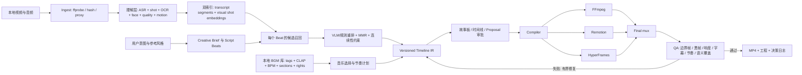

# 视频剪辑 Agent 深度调研（第一轮）

> 面向：已有视频理解 → LLM 按用户意图生成视频脚本 → Agent 选取片段 → 本地检索 BGM → 合成视频文件  
> 日期：2026-09-06  
> 范围：OpenMontage、video-use、FireRed-OpenStoryline、OpenChatCut、OpenEdit；补充 Remotion 与 HyperFrames 的底座定位。

## 结论先行

这五个项目不是同一种产品的不同实现，而是视频 Agent 栈的五个不同层面：

- **video-use**：最好的“LLM 可读素材表示”样板。核心不是 FFmpeg，而是把长视频压缩成词级转写与按需视觉时间轴，让 LLM 不必吞所有帧。
- **FireRed-OpenStoryline**：与目标产线最像的端到端节点图。它已经把镜头切分、VLM 理解、筛选、分组、写稿、选 BGM、卡点、时间线和渲染串起来。
- **OpenMontage**：最值得借鉴的不是某个渲染器，而是生产治理：显式阶段、结构化产物、素材 provenance、审批门、成本预算、质量门、失败回退。其 documentary-montage 还提供了最完整的本地素材库与语义选片范式。
- **OpenChatCut**：最成熟的“Agent 修改真实工程”样板。它解决工程状态、帧级时间线、可验证草稿、原子提交、撤销重做、人工审阅和可视化，而不是只返回一个 MP4。
- **OpenEdit**：最有价值的是字幕/MG 的设计知识、确定性 recipe、渲染前机械检查和渲染后探针；它不是通用时间线编辑器，V1 仍以字幕为主。

因此建议不要 fork 某一个项目并一路魔改。更合理的产品架构是：

1. 用 **video-use 的 transcript-first 思路**设计低 token 的理解面；
2. 用 **OpenStoryline 的节点链**定义第一版业务流程；
3. 用 **OpenMontage 的 corpus + retrieval + checkpoint/gate**升级素材检索与生产治理；
4. 用 **OpenChatCut 的 ProjectDoc/命令层/草稿审批**做可编辑工程和 GUI；
5. 用 **OpenEdit 的 recipe + lint/verify**建设字幕与 MG 的确定性质量体系；
6. FFmpeg 负责剪切、转码、混音和最终封装；Remotion/HyperFrames 只是可选的图形合成后端，不应成为核心工程格式。

## 一、应该从哪些维度看仓库

| 维度 | 要问的问题 | 容易被 README 隐藏的风险 |
|---|---|---|
| 产品任务 | 是“剪已有素材”、长转短、字幕包装，还是从想法生成整片？ | 功能很多，但没有清晰的主路径 |
| 素材理解 | ASR、镜头切分、OCR、人脸、动作、情绪、质量、运动量分别怎么做？ | “理解视频”可能只是抽 3 张图写一句 caption |
| LLM 上下文 | LLM 看到原始帧、联系表、转写、embedding 结果，还是结构化摘要？ | 全量喂帧导致成本和上下文爆炸 |
| 选片机制 | 是一次 LLM 全排序、向量召回、规则过滤、VLM rerank，还是人工点选？ | 把“搜索”和“最终剪辑判断”混为一谈 |
| 脚本—镜头绑定 | 脚本先于素材还是素材先于脚本？每个 beat 如何绑定候选片段？ | 文案和画面各自合理，但互不对应 |
| 编辑中间表示 | 是否有 source range、timeline range、轨道、转场、音量、理由、provenance、版本？ | 直接让 LLM 写 FFmpeg 命令，无法审阅和迁移 |
| 音乐系统 | 只是随机/标签选歌，还是有 BPM、downbeat、section、energy、ducking 和授权信息？ | “卡点”只是等间隔切镜头 |
| 合成后端 | FFmpeg、MoviePy、Remotion、HyperFrames 各负责什么？ | 一个渲染后端反过来绑架工程模型 |
| 人机协作 | 用户在哪些阶段看脚本、候选镜头、故事板、时间线和最终片？ | 最后才看 MP4，返工成本最高 |
| 质量与评测 | 有 schema、静态 lint、边界帧、音频检测、渲染探针、人工 rubric 吗？ | “命令成功”被当成“视频可用” |
| 可复现与治理 | 缓存、内容哈希、checkpoint、成本、重试、决策日志、许可证是否齐全？ | 重跑结果漂移，无法解释选片原因 |
| 集成约束 | 许可证、平台、云 API、本地模型、GPU、闭源依赖是什么？ | Demo 可跑不等于可进入产品 |

看仓时最重要的原则是：**把产品宣称拆成可检验的产物与状态转换。** “支持智能选片”不算答案；要继续追问输入 artifact 是什么、输出 schema 是什么、如何复现、如何失败、用户在哪里批准。

## 二、五个重点仓库

### 1. video-use：最小但思想最干净的剪辑 Agent

**产品定位。** 它的主任务是对已有素材做对话式剪辑：去口误和停顿、跨 take 选段、调色、字幕、可选动画 overlay，最后交付 MP4；没有时间线 GUI。README 明确描述了原始素材到 `final.mp4` 的路径以及功能边界（[README](/Users/panjx/code/video-agent/video-use/README.md:7)）。

**最值得借鉴：LLM 的“读视频”接口。** 它默认只把词级转写压成很小的 phrase-level Markdown，视觉只在歧义停顿、take 对比和切点检查时生成 filmstrip + waveform + word labels（[README](/Users/panjx/code/video-agent/video-use/README.md:71)）。这比“固定每秒抽帧全部送 VLM”更适合长素材。

**中间表示。** `edl.json` 是非常适合 MVP 的最小编辑表示：source、start/end、beat、quote、reason，再加 grade、字幕与 overlay。每个切点携带理由很重要，它让修改和 QA 有依据（[SKILL](/Users/panjx/code/video-agent/video-use/SKILL.md:268)）。

**质量闭环。** 它把字幕最后叠加、切点音频 fade、词边界和输出时间轴字幕偏移写成不可违反的生产规则（[SKILL](/Users/panjx/code/video-agent/video-use/SKILL.md:18)）；渲染后再对每个切点生成视觉/波形检查图，最多自修三轮（[SKILL](/Users/panjx/code/video-agent/video-use/SKILL.md:91)）。

**局限。**

- 理解明显偏音频优先，不适合大量无对白 B-roll 的全局语义选片。
- 没有项目级语义素材库、真正的多轨工程和 GUI。
- 转写默认依赖 ElevenLabs；需要抽象成可替换 ASR provider。
- LLM 直接承担选 take 和叙事判断，规模变大后需要检索层先缩小候选集。

**建议吸收。** 直接借鉴其 packed transcript、按需 `timeline_view`、最小 EDL、切点 padding/fade、渲染后边界 QA。MIT 许可证也使代码复用相对简单。

### 2. FireRed-OpenStoryline：最接近目标产线的参考实现

**产品定位。** 它是对话式视频制作流水线，明显偏 Vlog、种草、旅行、开箱等“多素材 → 叙事短片”。核心能力覆盖素材搜索/整理、画面理解、脚本、私有 BGM、配音、字体、自然语言精修和把剪辑逻辑保存为 Skill（[README](/Users/panjx/code/video-agent/FireRed-OpenStoryline/README_zh.md:44)）。GUI 是聊天、工具进度、媒体预览和节点地图，不是真正可手调的 NLE 时间线。

**节点链与我们的需求几乎同构。** 配置直接列出 `SplitShots → UnderstandClips → FilterClips → GroupClips → GenerateScript → SelectBGM → PlanTimeline → RenderVideo`（[config.toml](/Users/panjx/code/video-agent/FireRed-OpenStoryline/config.toml:43)），默认 workflow Skill 也按同样顺序指导 Agent（[default workflow](/Users/panjx/code/video-agent/FireRed-OpenStoryline/.storyline/skills/default_editing_workflow_skill/SKILL.md:9)）。

**素材理解。** 每个 clip 被送入 VLM，输出不超过 100 字的客观 caption 与美学分，然后再由 LLM 汇总整体故事（[understand_clips.py](/Users/panjx/code/video-agent/FireRed-OpenStoryline/src/open_storyline/nodes/core_nodes/understand_clips.py:53)）。默认每秒抽 2 帧、单 clip 最多 64 帧（[config.toml](/Users/panjx/code/video-agent/FireRed-OpenStoryline/config.toml:66)）。

**选片与写稿。** Filter 主要依据 caption、审美分和时长；但默认提示词强制保留超过 80% 的 clip（[filter prompt](/Users/panjx/code/video-agent/FireRed-OpenStoryline/prompts/tasks/filter_clips/zh/system.md:7)），这更像“去明显废片”，不是为脚本 beat 做竞争性选片。之后 Group 阶段强调场景聚合与 Hook → Core → Vibe → End，再依据每组画面和字数预算生成第一人称 Vlog 文案（[group prompt](/Users/panjx/code/video-agent/FireRed-OpenStoryline/prompts/tasks/group_clips/zh/system.md:16)、[script prompt](/Users/panjx/code/video-agent/FireRed-OpenStoryline/prompts/tasks/generate_script/zh/system.md:32)）。

**本地 BGM。** 这是五仓中最贴合“本地搜歌”的现成实现之一：先从本地 `bgm_dir/meta.json` 建向量库做语义召回，再由 LLM 选一首；随后用 librosa 计算 BPM、beat、能量和动态范围，并对强拍做局部归一化与峰值筛选（[select_bgm.py](/Users/panjx/code/video-agent/FireRed-OpenStoryline/src/open_storyline/nodes/core_nodes/select_bgm.py:31)、[select_bgm.py](/Users/panjx/code/video-agent/FireRed-OpenStoryline/src/open_storyline/nodes/core_nodes/select_bgm.py:220)）。时间线规划器可把片段时长对齐到 beat（[plan_timeline_pro.py](/Users/panjx/code/video-agent/FireRed-OpenStoryline/src/open_storyline/nodes/core_nodes/plan_timeline_pro.py:13)）。

**渲染。** Timeline schema 已区分 source window、timeline window、video/subtitle/voiceover/BGM tracks（[node_schema.py](/Users/panjx/code/video-agent/FireRed-OpenStoryline/src/open_storyline/nodes/node_schema.py:135)），但渲染器主要由 MoviePy 组装并由 FFmpeg 编码，视频轨实际按时间顺序 concat，复杂多轨与可编辑性有限（[render_video.py](/Users/panjx/code/video-agent/FireRed-OpenStoryline/src/open_storyline/nodes/core_nodes/render_video.py:700)、[render_video.py](/Users/panjx/code/video-agent/FireRed-OpenStoryline/src/open_storyline/nodes/core_nodes/render_video.py:845)）。

**建议吸收。** 节点 schema、VLM caption + aesthetic score、本地 BGM 元数据与节拍分析、脚本字数预算、可复用 workflow Skill。不要原样复制“保留 80% 素材”的过滤规则，也不要把 MoviePy renderer 当长期底座。

### 3. OpenMontage：生产治理与检索优先的素材库

**产品定位。** 它是“从想法/参考片到成片”的 Agent 生产系统，而不是单纯剪辑器。统一阶段为 `research → proposal → script → scene_plan → assets → edit → compose`，各阶段由 YAML manifest、Markdown director Skill、结构化 artifact、review 和 checkpoint 驱动（[README](/Users/panjx/code/video-agent/OpenMontage/README.md:362)、[architecture](/Users/panjx/code/video-agent/OpenMontage/docs/ARCHITECTURE.md:9)）。

**最值得借鉴：脚本 beat → 素材 slot → 候选 corpus → edit decisions。** documentary-montage 先要求每个 slot 有具体描述、搜索词、hold 时长和 hero 标记，再构建候选库、选一个 clip、记录 rejected picks，最后决定 in/out、转场和音乐（[pipeline manifest](/Users/panjx/code/video-agent/OpenMontage/pipeline_defs/documentary-montage.yaml:45)）。这是比“一次让 LLM 看完所有 caption 后输出顺序”更可扩展的模式。

**素材库与检索。** Corpus 将下载素材、5 帧缩略图、视觉 embedding、标签 embedding、motion score、时长、来源、原始 URL 和许可证落在项目目录（[corpus.py](/Users/panjx/code/video-agent/OpenMontage/lib/corpus.py:1)）。查询时融合 70% 视觉相似度与 30% 标签相似度，并支持 motion filter 和已使用素材排除（[corpus.py](/Users/panjx/code/video-agent/OpenMontage/lib/corpus.py:234)）；相似集合和去重采用 MMR，避免连续镜头视觉重复（[corpus.py](/Users/panjx/code/video-agent/OpenMontage/lib/corpus.py:317)）。

**检索治理。** Asset Director 明确要求 corpus 大小约为 slot 数的 8–12 倍、低分时扩库而不是硬选、top 3–5 要做人工/Agent 判断、并记录 provenance 和 rejected reason（[asset director](/Users/panjx/code/video-agent/OpenMontage/skills/pipelines/documentary-montage/asset-director.md:238)）。Edit Director 则把节奏、并置、音乐同步、统一视觉 register 和相邻镜头多样性写成可审计规则（[edit director](/Users/panjx/code/video-agent/OpenMontage/skills/pipelines/documentary-montage/edit-director.md:23)）。

**局限。**

- Corpus 当前把一个 clip 的多帧池化成单向量，容易丢失 clip 内部动作和时间结构；适合先召回，不适合直接确定精确 in/out。
- CLIP ViT-B/32 与经验阈值只是 baseline；跨语言、细动作、品牌/人物、镜头连续性仍需 VLM rerank。
- Agent 本身充当 orchestrator，灵活但难做严格状态机、并发、幂等和在线服务 SLA。
- README 与架构文档的工具数量口径不同，说明仓库迭代很快；应信 schema 和实现，不信营销数字。
- AGPL-3.0 会影响直接集成方式。

**建议吸收。** Artifact contract、slot-based retrieval、corpus provenance、双通道向量检索、MMR、多阶段审批、checkpoint、成本/质量门。建议重写为自己的服务，而不是直接把整个仓库嵌入产品。

### 4. OpenChatCut：把 Agent 输出变成“可继续编辑的工程”

**产品定位。** 它把对话 Agent 与多轨时间线放在同一工作区；所有编辑最终落到轨道、片段、字幕、转场和特效，支持审阅、撤销、重做、版本与导出，而不是只生成不可修改的 MP4（[README](/Users/panjx/code/video-agent/OpenChatCut/README_ZH.md:62)）。

**最值得借鉴：工程模型和命令边界。** `ProjectDoc` 明确包含共享素材池、多时间线、活动时间线与 design style，并有显式版本用于迁移（[projectTypes.ts](/Users/panjx/code/video-agent/OpenChatCut/src/editor/projectTypes.ts:6)）。Agent 的 `edit_item` 支持 adds/updates/deletes，在私有 draft 中整批校验，只有全部成功才发布；还支持 validate-only（[edit-item schema](/Users/panjx/code/video-agent/OpenChatCut/src/agent/tools/schemas/edit-item-tools.ts:3)）。

**人机协作模型。** 外部 Agent 先 `begin_edit_session`，所有改动进入隔离草稿，然后 `review_edit_session`；manual 模式由 GUI 逐项审阅，auto 模式原子应用，整个操作成为一个 undo 节点（[README](/Users/panjx/code/video-agent/OpenChatCut/README_ZH.md:328)）。这是目标产品最应该复用的交互语义。

**素材与音乐理解。** 它有本地 Chinese-CLIP 帧 embedding，长视频按场景抽样，fallback 默认 15 秒一帧、最多 12 帧，场景模式最多 96 帧（[types.ts](/Users/panjx/code/video-agent/OpenChatCut/src/media/semantic-search/types.ts:1)、[samplingConfig.ts](/Users/panjx/code/video-agent/OpenChatCut/src/media/semantic-search/samplingConfig.ts:28)）。音乐侧使用本地 Beat This + CLAP，输出 BPM、拍号、标签、段落和 beat/downbeat，并以只读 plan → stale ref 校验 → 单次 undo 提交的方式卡点（[music tool schema](/Users/panjx/code/video-agent/OpenChatCut/src/agent/tools/schemas/music-intelligence-tools.ts:84)）。

**指导质量。** 其 Long Video to Shorts 不只给流程，还提供可复现的候选评分：独立完整度、hook、payoff、语境完整、视觉强度、平台适配、边界和差异性，并要求保存证据说明（[selection rubric](/Users/panjx/code/video-agent/OpenChatCut/src/agent/skills/long-video-to-shorts/references/short-form-selection.md:35)）。

**局限。**

- 工程和工具面很大，若只需自动成片，直接采用会带来较高复杂度。
- 当前语义索引可用于粗召回，但默认抽样仍不足以支撑精确动作时刻选择。
- 其 AGPL-3.0 许可证需要在产品集成前单独评估。

**建议吸收。** 把它当“编辑操作系统”而不是“创作大脑”：ProjectDoc、帧级时间基准、统一 command layer、draft/proposal、undo、MCP、时间线 GUI、frame inspection、音乐 plan/apply 两阶段协议。

### 5. OpenEdit：字幕和 MG 的工业化知识库

**产品定位。** 它明确没有 GUI 和时间线，由 coding agent 驱动，支持剪切、reframe、字幕、图形、网页/幻灯片转视频等；V1 主要目标仍是 captions（[README](/Users/panjx/code/video-agent/open-edit/README.md:23)、[README](/Users/panjx/code/video-agent/open-edit/README.md:176)）。

**最值得借鉴：把创意工作拆成确定性生成和受控创作。** 默认字幕由 compiled recipe 确定性生成；只有用户提供品牌/参考或要求 remix 时才让 Agent inline author。所有路径走 lint → verify → record → probe-QA → mux（[FLOW](/Users/panjx/code/video-agent/open-edit/docs/FLOW.md:21)）。

**理解与设计分离。** Vision pass 默认关闭，只有用户要求 refine 时才读帧并输出每个 beat 的 subject/face/negative-space/brightness；后续设计只读结构化数字，不重复看图（[FLOW](/Users/panjx/code/video-agent/open-edit/docs/FLOW.md:25)）。这是降低多轮漂移的好办法。

**引擎边界被写成可测试知识。** 例如字幕必须使用真实词时序、整条视频用单一可寻址 timeline、FFmpeg 先完成暂停/变速/trim，HTML 引擎只负责视觉层（[director brief](/Users/panjx/code/video-agent/open-edit/pipeline/director-brief.md:140)、[director brief](/Users/panjx/code/video-agent/open-edit/pipeline/director-brief.md:183)）。

**局限。**

- 不提供通用可编辑工程；preview 主要是只读观看、转写跟随与 scrub。
- 自带 VEED renderer 闭源且另有 PolyForm Shield 条款；虽然可换 Chrome 后端，但不能把它视为完全开放的渲染栈（[README](/Users/panjx/code/video-agent/open-edit/README.md:127)、[README](/Users/panjx/code/video-agent/open-edit/README.md:183)）。
- MG、图表等能力在 README 中明确比 captions 少验证。

**建议吸收。** Recipe compiler、design system artifact、caption timing contract、safe-zone/face avoidance、静态 lint、渲染探针、确定性路径与创意路径分流。不要把 `.wv` 或闭源 renderer 变成产品的唯一标准。

## 三、FFmpeg、Remotion、HyperFrames 应该怎么分工

它们不是三选一。

| 后端 | 最适合 | 不应该承担 |
|---|---|---|
| FFmpeg | 精确 trim/concat、转码、变速、响度、ducking、字幕烧录、滤镜、最终 mux | 让 LLM 直接手写复杂 filtergraph 作为工程真相 |
| Remotion | React 组件化 MG、数据驱动画面、复杂多层合成、Player 预览 | 素材检索、脚本规划、工程语义本身 |
| HyperFrames | HTML/CSS/GSAP、网页/产品动效、kinetic type、透明 overlay、seek-safe 动画 | 精确剪辑决策与全局素材理解 |

HyperFrames 自己也把定位写成“HTML/CSS/media/seekable animation → deterministic MP4”，并要求 plan、lint、preview、render 的 Agent loop（[README](/Users/panjx/code/video-agent/hyperframes/README.md:32)）。Remotion 则强调 React code 是 source of truth，适合程序化、交互式和批量视频制作（[README](/Users/panjx/code/video-agent/remotion/README.md:15)）。

核心原则：**编辑工程格式必须高于渲染器。** Timeline IR 经 compiler 分别产生 FFmpeg job、Remotion composition 或 HyperFrames document；将来替换某个后端不应改变用户的剪辑工程。

## 四、建议的目标产线



### 1. Ingest 与规范化

- 不改原文件；为每个素材计算内容哈希。
- `ffprobe` 采集 codec、fps、旋转、色彩空间、音轨、duration。
- 对难解码素材生成统一 proxy，但所有 source range 仍指向原片。
- 所有时间最终使用整数 frame 或 rational time base，禁止跨模块混用浮点秒和毫秒。

### 2. 建立“稀疏但多视角”的素材理解层

不要只选 video-use 的 transcript，也不要只选 OpenStoryline 的 VLM caption。两者应并存：

- Speech index：词级 ASR、说话人、audio events、phrase boundaries。
- Shot index：镜头边界、代表帧、短时动作摘要、主体/场景/OCR、审美与技术质量、运动方向/强度。
- Geometry index：face/person bbox、negative space、主体轨迹，供裁切、字幕和 MG 放置。
- Audio index：原声类型、峰值、静音、环境声、可否做 J/L cut。
- Embedding index：shot-level visual vector、caption/text vector；不要把整个长 clip 永久压成一个向量。

LLM 的默认阅读面应是“脚本相关的 compact transcript + shot cards”，原始帧只在候选重排和 QA 时按需读取。

### 3. 先产出 Creative Brief，再写 Script Beats

建议把用户自然语言转成显式约束：目的、受众、平台、时长、画幅、叙事视角、节奏、是否旁白、字幕/MG 密度、must-use/must-avoid、品牌规范、音乐偏好。

脚本不要只是一段文案，而是 beat 数组：

```json
{
  "beatId": "b03",
  "purpose": "proof",
  "narration": "...",
  "durationTargetFrames": 120,
  "visualIntent": "产品在真实户外环境中被使用",
  "mustShow": ["backpack", "walking"],
  "avoid": ["studio"],
  "energy": 0.72,
  "transitionIntent": "hard-cut-on-downbeat"
}
```

这一步吸收 OpenStoryline 的“分组画面 → 字数预算 → 文案”，但应保留开放叙事类型，不固定成第一人称 Vlog。

### 4. 两阶段选片，而不是把所有 clip 交给一次 LLM

每个 beat：

1. **召回**：text-to-visual、transcript、OCR、人物/地点、时长、画幅、质量和 motion filter，取 20–50 个候选。
2. **重排**：VLM 看候选联系表/短片，按内容匹配、动作完整、视觉质量、边界可剪、连续性、情绪和 rights 评分。
3. **组合优化**：跨 beat 做 MMR/相邻多样性、主体连续、运动方向、色彩 register、重复素材和全局时长约束。
4. **保留替补**：每个 slot 保存 top-3 与 rejected reasons，用户换镜头无需重新理解全库。

OpenMontage 的 corpus 适合作为召回层；OpenChatCut 的候选评分 rubric 适合作为 rerank 解释层；OpenStoryline 的一次性筛选不应成为最终算法。

### 5. 本地 BGM 应有两个索引

- Catalog index：路径、来源、许可证、mood、genre、instrument、vocal、language、允许使用场景。
- Signal index：CLAP embedding、BPM/meter、beats/downbeats、sections、energy curve、loudness、loopable windows。

选择音乐先做语义检索，再做结构适配；不是让 LLM 从全部文件名里猜。选中后生成只读 `music_edit_plan`，展示哪些镜头落在 section/downbeat，用户确认后再写 timeline。这里可以直接融合 OpenStoryline 的本地库 + librosa 与 OpenChatCut 的 Beat This/CLAP + plan/ref 协议。

### 6. Timeline IR 是真正的产品核心

建议至少包含：

```json
{
  "version": 1,
  "fps": {"num": 30000, "den": 1001},
  "assets": [{"id": "a1", "uri": "...", "hash": "...", "rights": {}}],
  "tracks": [],
  "items": [{
    "id": "i7",
    "assetId": "a1",
    "source": {"fromFrame": 914, "durationFrames": 126},
    "timeline": {"trackId": "V1", "fromFrame": 600, "durationFrames": 126},
    "role": "b03/proof",
    "reason": "动作完整且与旁白中的户外使用相符",
    "confidence": 0.83,
    "alternatives": ["candidate-12", "candidate-19"]
  }],
  "audioAutomation": [],
  "captions": [],
  "graphics": [],
  "decisionLog": []
}
```

对 Agent 暴露的不是任意 JSON patch，而是 `read_project`、`propose_edit`、`validate_edit`、`apply_proposal`、`undo` 等强 schema 命令。大改动必须在草稿中原子提交。

### 7. GUI 不需要一开始就做完整 Premiere

第一阶段最有效的 GUI 是三个审阅面：

1. **Script/Beat board**：每段文案、目标时长、镜头意图。
2. **Candidate storyboard**：当前选择 + 2 个替补 + 选择理由 + 播放范围。
3. **Timeline review**：多轨、字幕、音乐段落、proposal diff、apply/reject/undo。

OpenMontage Backlot 证明“生产看板 + approval gate”有价值；OpenChatCut 证明“真实时间线 + 草稿审阅”有价值。可以先做故事板和 proposal diff，后面再补复杂手工剪辑操作。

### 8. 编译与 QA

推荐三层验证：

- Plan lint：素材存在、source range 合法、轨道不冲突、时长闭合、字幕时间单调、版权字段齐全。
- Render probes：输出 codec/fps/duration、黑帧/冻结帧、静音/削波、响度、字幕安全区、人脸遮挡、MG bounds。
- Editorial eval：脚本覆盖、镜头—文案一致、hook/payoff、重复度、切点完整、音乐节奏、品牌一致。

自动修复必须有界：机械问题可自动修 2–3 次；语义或审美问题回到候选/脚本审批，不要无限重渲染。

## 五、复用优先级

| 模块 | 首选来源 | 策略 |
|---|---|---|
| packed transcript / 切点可视化 | video-use | 可直接借鉴或复用实现 |
| 镜头节点链与基础 schema | OpenStoryline | 借鉴接口，重写编排层 |
| VLM clip caption + aesthetic | OpenStoryline | 保留 baseline，增加批处理、缓存和可校准评测 |
| 本地 BGM 召回与 beat | OpenStoryline + OpenChatCut | 合并 catalog/vector 与高级音乐结构分析 |
| 素材 corpus/provenance/MMR | OpenMontage | 重写为独立 indexing/retrieval service |
| 可解释选片 rubric | OpenChatCut + OpenMontage | 做成可版本化评分器与 eval 数据格式 |
| 工程/命令/撤销/提案 | OpenChatCut | 若许可证允许可集成，否则复刻架构语义 |
| 字幕与 MG recipe/gates | OpenEdit | 借鉴规范和 lint；避免绑定闭源 renderer |
| 精剪与最终 mux | FFmpeg | 自有确定性 compiler |
| 复杂 MG | Remotion / HyperFrames | 插件式 backend，按 visual grammar 选择 |

## 六、建议的 MVP 分期

### Phase 1：先证明“能选对、能讲通”

- 输入 5–100 个本地视频。
- ASR + 镜头切分 + VLM shot cards。
- 用户意图 → 结构化 brief → script beats。
- 每 beat top-k 检索 + VLM rerank + 替补镜头。
- 本地 BGM 标签检索 + librosa beat。
- 最小 EDL → FFmpeg render。
- GUI 只做 beat board、候选故事板和视频预览。

成功标准不是“成功导出”，而是：镜头—文案匹配率、用户替换镜头率、首版可接受率、每分钟素材理解成本和人工修改时间。

### Phase 2：工程化与可修订

- Versioned Timeline IR、帧级时间、命令层、proposal/diff/undo。
- 多轨音频、ducking、字幕、简单转场、source provenance。
- OpenEdit/video-use 风格的 lint、边界检查和输出 QA。
- 缓存、幂等、失败恢复、job 状态和成本追踪。

### Phase 3：视觉包装与规模化

- Remotion/HyperFrames MG 插件。
- 人脸/主体跟踪、自动 reframe、字幕/MG 避让。
- 用户 design profile 与可复用 style recipe。
- Batch variants、长素材库增量索引和离线 eval suite。

## 七、第一轮最值得继续讨论的三个决策

1. **脚本是“从素材中发现故事”，还是“先写故事再找素材”？** 两种模式需要不同 planner。建议产品同时支持 `material-first` 与 `brief-first`，但 MVP 先选一个主路径。
2. **用户要的是最终 MP4，还是可继续修改的工程？** 如果后者是核心价值，Timeline IR 和 proposal GUI 必须从第一天存在，不能后补。
3. **素材规模是多少？** 20 个 Vlog clip、10 小时访谈、还是长期积累的万条素材库，会直接决定是否需要向量数据库、分层摘要和异步索引。

我的初步产品判断：若目标用户是普通创作者，最有差异化的首发形态不是“又一个 AI 时间线编辑器”，而是 **可解释的素材导演**——用户给一堆素材和一句意图，系统先交付可替换的脚本—镜头故事板，确认后再生成工程与 MP4。这样把最昂贵的语义错误拦在渲染之前，也最能综合五个项目的长处。

## 研究限制

- 本轮为源码快速深扫，没有安装并完整跑通五个项目的 E2E demo，也没有对渲染速度、模型成本和成片质量做同素材基准测试。
- 仓库均为 2026-09-06 前后浅克隆快照，OpenStoryline 的 README news/TODO、OpenMontage 的工具数量等存在文档口径漂移；本报告优先采用源码和 schema。
- 许可证部分只用于技术选型预警，不构成法律意见。

